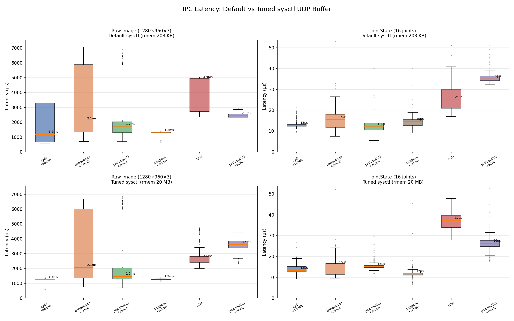
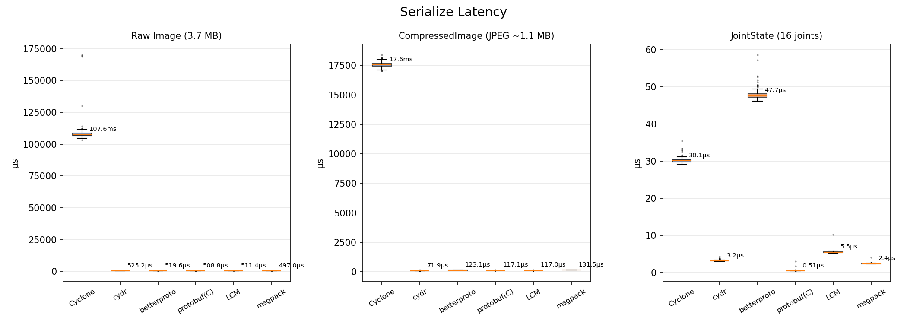
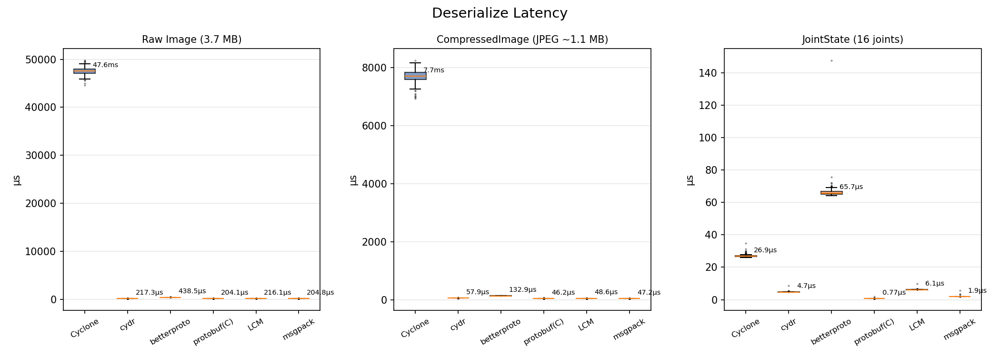

# IPC Benchmark: CDR vs Protobuf vs LCM vs msgpack

Benchmarks comparing serialization performance and IPC latency for robotics message types across six serialization backends and three transport layers.

## What's tested

**Serialization only** (`bench_serdes.py`):
- `ros2_pyterfaces` cyclone backend (CDR via Cyclone DDS Python)
- `ros2_pyterfaces` cydr backend (CDR via cydr/msgspec)
- [betterproto](https://github.com/danielgtaylor/python-betterproto) (pure Python protobuf)
- Google [protobuf](https://protobuf.dev/) with C/upb backend
- [LCM](https://github.com/lcm-proj/lcm) (types generated via `lcm-gen`)
- [msgpack](https://github.com/msgpack/msgpack-python) (MessagePack binary serialization)
- Message types: `Image` (1280×960×3 raw), `CompressedImage` (JPEG), `JointState` (16 joints)
- Roundtrip correctness verified for all backends

**End-to-end IPC** (`bench_ipc.py`):
- cydr + zenoh
- betterproto + zenoh
- Google protobuf(C) + zenoh
- msgpack + zenoh
- Google protobuf(C) + [eCAL](https://github.com/eclipse-ecal/ecal) (SHM transport)
- LCM (UDP multicast)
- Measures single-process pub/sub latency with embedded timestamps
- Generates box plots comparing all six stacks

**MCAP visualization** (`bench_mcap_viz.py`):
- Writes protobuf messages to MCAP using Foxglove well-known schemas
- Verifies roundtrip via mcap-protobuf-support reader
- Tests rerun MCAP → RRD conversion

## Setup

Requires [pixi](https://pixi.sh) (manages Python 3.12 + all dependencies):

```bash
pixi install
```

For LCM large-message benchmarks, increase the kernel UDP buffer:

```bash
sudo sysctl -w net.core.rmem_max=20971520 net.core.rmem_default=20971520
```

LCM types are generated from `bench_msgs.lcm` via:
```bash
pixi run lcm-gen -p bench_msgs.lcm
```

Protobuf types are generated from `bench_msgs.proto` via:
```bash
pixi run protoc --python_out=. bench_msgs.proto
```

## Run

```bash
# Serialization-only benchmark
pixi run python bench_serdes.py

# IPC (serialize + transport + deserialize) benchmark with box plots
pixi run python bench_ipc.py

# MCAP visualization test (writes .mcap + converts to .rrd)
pixi run python bench_mcap_viz.py
```

## Sample results

### Serialization (µs per call)

**Raw Image (1280×960×3, 3.7 MB):**

| | Cyclone | cydr | betterproto | protobuf(C) | LCM | msgpack |
|---|---|---|---|---|---|---|
| serialize | 109,018 | 525 | 520 | 509 | 512 | 498 |
| deserialize | 47,550 | 217 | 440 | 206 | 217 | 206 |

**CompressedImage (JPEG, ~1.1 MB):**

| | Cyclone | cydr | betterproto | protobuf(C) | LCM | msgpack |
|---|---|---|---|---|---|---|
| serialize | 17,574 | 72 | 123 | 118 | 117 | 131 |
| deserialize | 7,679 | 58 | 134 | 46 | 49 | 47 |

**JointState (16 joints):**

| | Cyclone | cydr | betterproto | protobuf(C) | LCM | msgpack |
|---|---|---|---|---|---|---|
| serialize | 30 | 3.2 | 48 | 0.5 | 5.6 | 2.4 |
| deserialize | 27 | 4.7 | 67 | 0.8 | 6.2 | 1.9 |

### Payload sizes (bytes)

| Message | CDR | Protobuf | LCM | msgpack |
|---|---|---|---|---|
| raw Image | 3,686,448 | 3,686,420 | 3,686,433 | 3,686,473 |
| CompressedImage (JPEG) | 1,102,144 | 1,102,118 | 1,102,129 | 1,102,134 |
| JointState (16 joints) | 644 | 543 | 594 | 613 |

### IPC median latency (µs)

**Default sysctl** (`rmem_max=208K`):

| Message | cydr+zenoh | betterproto+zenoh | protobuf(C)+zenoh | msgpack+zenoh | LCM | protobuf(C)+eCAL |
|---|---|---|---|---|---|---|
| Image (3.7 MB) | 1,486 | 13,763 | 2,267 | 1,504 | 4,819 ¹ | 2,798 |
| JointState (644 B) | 18.8 | 17.6 | 20.9 | 18.2 | 39.3 | 40.2 |

**Tuned sysctl** (`rmem_max=20MB`):

| Message | cydr+zenoh | betterproto+zenoh | protobuf(C)+zenoh | msgpack+zenoh | LCM | protobuf(C)+eCAL |
|---|---|---|---|---|---|---|
| Image (3.7 MB) | 1,259 | 2,118 | 1,314 | 1,262 | 4,730 | 2,791 |
| JointState (644 B) | 17.3 | 7.1 | 15.5 | 18.0 | 40.8 | 25.3 |

¹ LCM drops most Image packets with default sysctl; tuned sysctl required for reliable large-message LCM.

### IPC latency box plots



### Serialization latency bar charts





## Dependencies

Managed by pixi. Key packages:
- [ros2-pyterfaces](https://github.com/2lian/ros2-pyterfaces) — ROS 2 message serialization (cyclone + cydr backends)
- [zenoh](https://zenoh.io/) — zero-overhead pub/sub transport
- [lcm](https://github.com/lcm-proj/lcm) — Lightweight Communications and Marshalling
- [betterproto](https://github.com/danielgtaylor/python-betterproto) — pure Python Protobuf 3
- [protobuf](https://protobuf.dev/) — Google Protocol Buffers with C/upb backend
- [eclipse-ecal](https://github.com/eclipse-ecal/ecal) — high-performance pub/sub with SHM transport
- [msgpack](https://github.com/msgpack/msgpack-python) — MessagePack binary serialization
- [mcap-protobuf-support](https://github.com/foxglove/mcap) — MCAP file format with protobuf support
- [rerun-sdk](https://rerun.io/) — multimodal data visualization
