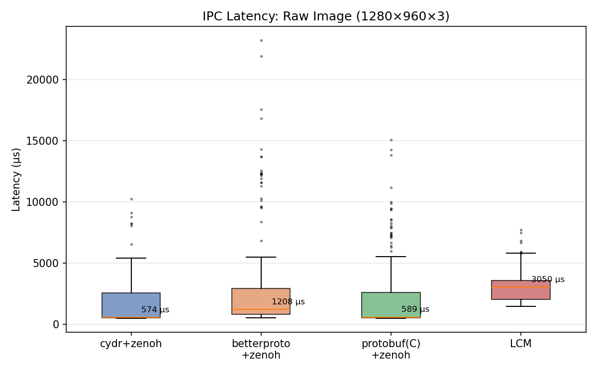
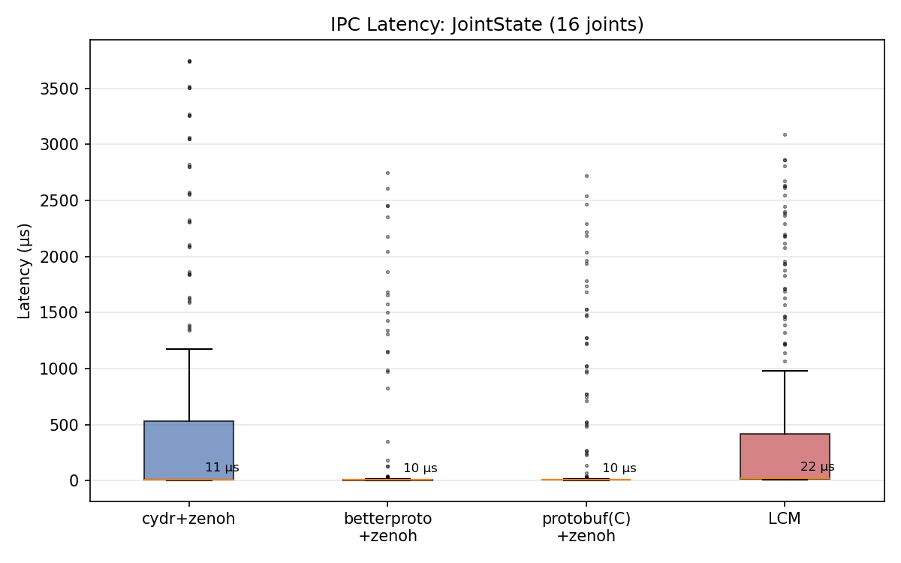

# IPC Benchmark: CDR vs Protobuf vs LCM

Benchmarks comparing serialization performance and IPC latency for robotics message types across five serialization backends and two transport layers.

## What's tested

**Serialization only** (`bench_serdes.py`):
- `ros2_pyterfaces` cyclone backend (CDR via Cyclone DDS Python)
- `ros2_pyterfaces` cydr backend (CDR via cydr/msgspec)
- [betterproto](https://github.com/danielgtaylor/python-betterproto) (pure Python protobuf)
- Google [protobuf](https://protobuf.dev/) with C/upb backend
- [LCM](https://github.com/lcm-proj/lcm) (types generated via `lcm-gen`)
- Message types: `Image` (1280×960×3 raw), `CompressedImage` (JPEG), `JointState` (16 joints)
- Roundtrip correctness verified for all backends

**End-to-end IPC** (`bench_ipc.py`):
- cydr + zenoh
- betterproto + zenoh
- Google protobuf(C) + zenoh
- LCM (UDP multicast)
- Measures single-process pub/sub latency with embedded timestamps
- Generates box plots comparing all four stacks

## Setup

Requires [pixi](https://pixi.sh) (manages Python 3.12 + all dependencies):

```bash
pixi install
```

For LCM large-message benchmarks, increase the kernel UDP buffer:

```bash
sudo sysctl -w net.core.rmem_max=20971520 net.core.rmem_default=20971520
```

LCM types are generated from `bench_msgs.lcm` via:
```bash
pixi run lcm-gen -p bench_msgs.lcm
```

Protobuf types are generated from `bench_msgs.proto` via:
```bash
pixi run protoc --python_out=. bench_msgs.proto
```

## Run

```bash
# Serialization-only benchmark
pixi run python bench_serdes.py

# IPC (serialize + transport + deserialize) benchmark with box plots
pixi run python bench_ipc.py
```

## Sample results

### Serialization (µs per call)

**Raw Image (1280×960×3, 3.7 MB):**

| | Cyclone | cydr | betterproto | protobuf(C) | LCM |
|---|---|---|---|---|---|
| serialize | 128,466 | 564 | 535 | 515 | 526 |
| deserialize | 56,357 | 215 | 440 | 203 | 225 |

**CompressedImage (JPEG, ~1.1 MB):**

| | Cyclone | cydr | betterproto | protobuf(C) | LCM |
|---|---|---|---|---|---|
| serialize | 20,678 | 75 | 127 | 124 | 142 |
| deserialize | 8,467 | 53 | 133 | 50 | 59 |

**JointState (16 joints):**

| | Cyclone | cydr | betterproto | protobuf(C) | LCM |
|---|---|---|---|---|---|
| serialize | 42 | 2.3 | 113 | 0.6 | 6.9 |
| deserialize | 39 | 3.4 | 88 | 1.1 | 8.1 |

### Payload sizes (bytes)

| Message | CDR | Protobuf | LCM |
|---|---|---|---|
| raw Image | 3,686,448 | 3,686,420 | 3,686,433 |
| CompressedImage (JPEG) | 1,102,468 | 1,102,442 | 1,102,453 |
| JointState (16 joints) | 644 | 543 | 594 |

### IPC median latency (µs)

| Message | cydr+zenoh | betterproto+zenoh | protobuf(C)+zenoh | LCM |
|---|---|---|---|---|
| Image (3.7 MB) | 574 | 1,208 | 589 | 3,050 |
| JointState (644 B) | 11.3 | 9.6 | 10.0 | 22.1 |

### IPC latency box plots





## Dependencies

Managed by pixi. Key packages:
- [ros2-pyterfaces](https://github.com/2lian/ros2-pyterfaces) — ROS 2 message serialization (cyclone + cydr backends)
- [zenoh](https://zenoh.io/) — zero-overhead pub/sub transport
- [lcm](https://github.com/lcm-proj/lcm) — Lightweight Communications and Marshalling
- [betterproto](https://github.com/danielgtaylor/python-betterproto) — pure Python Protobuf 3
- [protobuf](https://protobuf.dev/) — Google Protocol Buffers with C/upb backend
